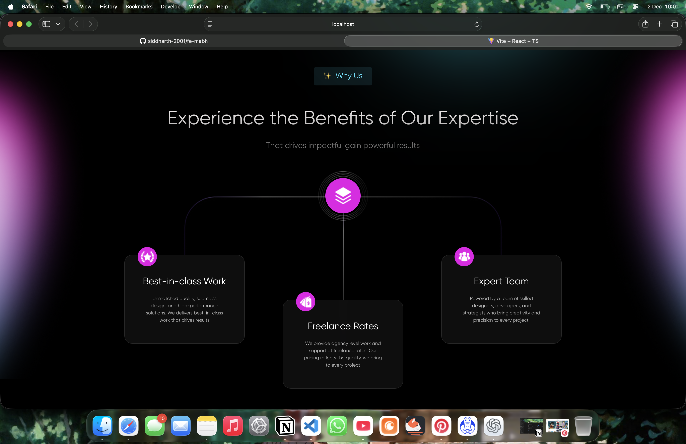

# Run with Bun

Prerequisites
- Install Bun: curl -fsSL https://bun.sh/install | bash
- Open a new terminal (to load Bun into PATH).

Quick start
1. Install dependencies
```bash
cd /fe-mabh
bun install
```

2. Start the dev server
```bash
bun run dev
# or if your package.json uses "start"
bun run start
# or run an entry file directly
bun src/index.js      # or src/index.ts
```

3. Build and preview
```bash
bun run build
bun run preview
```

If no scripts exist in package.json, add a minimal scripts block:
```json
{
  "scripts": {
    "dev": "your-dev-command",
    "start": "your-start-command",
    "build": "your-build-command",
    "preview": "your-preview-command"
  }
}
```

Notes
- bun run <script> works like npm run <script>.
- For platform-specific guidance or advanced setup see https://bun.sh.

Screenshot


